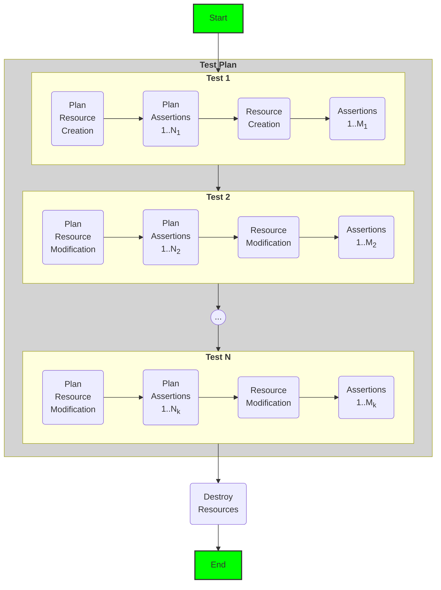

# Terraform Module Tests

Run tests on Terraform code with just a configuration. `infra-tester` implements the test flow described in the diagram below. The concrete steps in the test flow are described by a **test plan** in YAML format (see the example `config.yaml` to find out more about the format of the test plan). It uses the [terratest](https://terratest.gruntwork.io/) library, but doesn't require any knowledge about terratest or Golang.



### Running the Tests

#### Compiling the Test Binary

1. Change directory to [**`src/`**](src/).
2. Compile the binary by executing:
```
go test -c -o ../bin/infra-tester
```
3. If everything went fine, you will see the binary file named `infra-tester` in the `bin/` folder in root of this project. You can now copy this binary to one of the directories in you `$PATH` variable, or add the `bin/` directory to your `$PATH`.

#### Use `infra-tester` to Run the Example Tests

The below steps assume you have already compiled the binary and is added to `$PATH`.

1. Change directory to where the tests are located. You can find example tests in [**`example/`**](example/).
2. Run the tests by executing:
```
infra-tester -test.v
```
`-test.v` flag runs the test in verbose mode. You can see the full list of flags by running `infra-tester --help`

### Writing the Config

The configuration has the following structure:

```yaml
test_plan:
  name: <Name of the test plan, usually the resource or module name>
  destroy_vars:                                         # Optional field, if defined passes vars defined here to the final cleanup destroy.
    vars_to_pass_to_tf: apple                           # By default, infra-tester passes vars in the last test to terraform destroy.
    ...                                                 # If the last test has invalid vars, this field will be useful to pass valid vars to successfully run destroy.
  tests:
    - name: <Name of the test>
      with_clean_state: true                            # Whether this test should be run in a clean state. If true, terraform destroy will be run before running the tests.
      vars:                                             # Any values for the var you'd like to pass to terraform. Support complex objects as well
        check_condition: true
        complex_object: &complex_object
          id: 0
          count: 0
          str: "string"
          seq:
            - one
            - two
          map:
            key: value
      plan:                                             # Any assertions that are to run during the plan step
        assertions:
          - type: PlanSucceeds
      apply:                                            # Any assertions that are to run during the plan step
        ensure_idempotent: true                         # If true, makes sure the plan is idempotent
        assertions:                                     # list of assertions
          - type: <AssertionType>                       # The type of assertion
            <Assertion Inputs>                          # Any inputs to the assertions

          - type: OutputEqual                           # An example assertion
            output_name: sample_output
            value: it's working
```

## Assertions

#### Plan Assertions

```yaml
      plan:
        assertions:
          - type: PlanSucceeds                                  # Makes sure plan succeeds

          - type: PlanFails                                     # Makes sure plan fails

          - name: PlanMustFailWithSpecificError                 # Optional name for assertions. If defined, this will replace assertion type as the test name in test summary.
            type: PlanFailsWithError                            # Makes sure plan fails and that the error message contains a specific string
            error_message_contains: Intended to fail            # The string that the error should contain
```

```yaml
    apply:
        assertions:
          - type: ApplySucceeds                                 # Makes sure apply succeeds

          - name: ASimpleOutputEqual                            # compare the value of an output
            type: OutputEqual
            output_name: sample_output                          # name of the output
            value: it's working                                 # the value it should be equal to

          - name: OutputEqualForComplexOutputWithCompleteMatch  # compare the value of complex output
            type: OutputEqual
            complete_match: true                                # When enabled, ensure 'value' and terraform output must matches exactly with no fields and it's values missing or added in either of them. Default is false, which allows you to specify just the fields you need to check.
            output_name: a_complex_output                       # name of the output
            value:
              a_map:
                key: value
                one: 1
                float: 123.11
              a_seq: [1, 2, 3]
              bool: true

          - name: OutputEqualForComplexOutputWithPartialMatch   # An example of partial check which only checks fields specified in value.
            type: OutputEqual
            output_name: a_complex_output
            value:
              a_map:
                float: 123.11                                   # Checks just the value of 'a_map.float', doesn't check any other a_map.* keys
              bool: true                                        # checks just the value of 'bool' field at this level.

          - name: CheckMultipleOutputs                          # make sure values of multiple outputs are equal
            type: OutputsAreEqual
            output_names:                                       # the list of output names, all of which should have same value
              - sample_output
              - another_output
              - yet_another_output

          - name: EnsureOutputContainsString                    # Makes sure the value of an output contains a string
            type: OutputContains
            output_name: sample_output                          # name of the output
            value: working                                      # the substring value the output must contain

          - type: NoResourcesAffected                           # Makes sure no resources are affected

          - type: ResourcesAffected                             # assert number of resources affected
            added: 1                                            # Note that the test only checks for values explicitly specified here
            # changed: 0                                        # if "changed" key is omitted, it won't be checked
            # deleted: 5                                        # can also specify number of resources deleted

          - name: OutputMatchesARegularExpression               # asserts an output matches a regular expression
            type: OutputMatchesRegex
            output_name: an_output                              # output name
            regex: strings \w+ \d+ apple \d\s+\w+               # regular expression
```

## Test Output

A test summary is generated at the end of the test, which will look like:

```
-- PASS: TestMain (4.39s)
    --- PASS: TestMain/<TestPlanName> (4.39s)
        --- PASS: TestMain/<TestPlanName>/<TestName> (0.25s)
            --- PASS: TestMain/<TestPlanName>/<TestName>/Plan (0.25s)
                --- PASS: TestMain/<TestPlanName>/<TestName>/Plan/<PlanAssertion1> (0.00s)
                --- PASS: TestMain/<TestPlanName>/<TestName>/Plan/<PlanAssertion2> (0.00s)
                    ...
            --- PASS: TestMain/<TestPlanName>/<TestName>/Apply (0.25s)
                --- PASS: TestMain/<TestPlanName>/<TestName>/Apply/<ApplyAssertion1> (0.00s)
                --- PASS: TestMain/<TestPlanName>/<TestName>/Apply/<ApplyAssertion2> (0.00s)
                    ...
PASS
ok      schrodinger.com/infra-tester    4.890s
```

In the above test summary:
- `TestPlanName` is obtained from the `name` property of `test_plan` in the yaml config.
- `TestName` corresponds to the `name` of each test defined in the test plan.
- `PlanAssertion1`, `PlanAssertion2`, and so on refers to name (if defined, else assertion type) of the assertions in the plan step.
- `ApplyAssertion1`, `ApplyAssertion2`, and so on refers to name (if defined, else assertion type) of the assertions in the apply step.


As seen in the test summary, Plan and Apply tests are separated so you can run them separately using `-test.run` flag.
> **Note** If a test is dependent (e.g, by using a test as a "stage") on the resultant Terraform state of a previous test, then selectively running a test that has such a dependency will obviously fail. In this case, you might want to name the test and it's dependency test in such a way that, when you selectively run the test with a test name pattern, both the tests will be selected.
