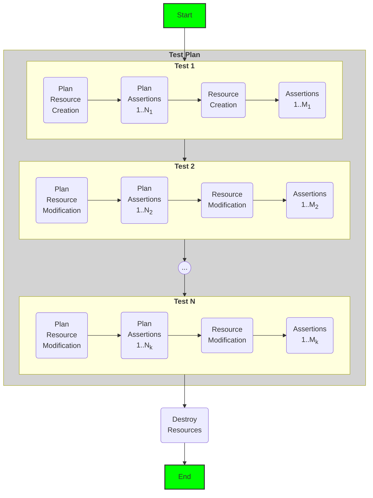

# Terraform Module Tests

Run tests on Terraform code with just a configuration. `infra-tester` implements the test flow described in the diagram below. The concrete steps in the test flow are described by a **test plan** in YAML format (see the example `config.yaml` to find out more about the format of the test plan). It uses the [terratest](https://terratest.gruntwork.io/) library, but doesn't require any knowledge about terratest or Golang.



### Running the Tests

You can run the tests with `go test -v`

You can run specific tests with `go test -v -run <test name pattern>`. See more about `-run` [here](https://pkg.go.dev/testing#hdr-Subtests_and_Sub_benchmarks)

### Writing the Config

The configuration has the following structure:

```yaml
test_plan:
  name: <Name of the test plan, usually the resource or module name>
  tests:
    - name: <Name of the test>
      with_clean_state: true                            # Whether this test should be run in a clean state. If true, terraform destroy will be run before running the tests.
      vars:                                             # Any values for the var you'd like to pass to terraform. Support complex objects as well
        check_condition: true
        complex_object: &complex_object
          id: 0
          count: 0
          str: "string"
          seq:
            - one
            - two
          map:
            key: value
      plan:                                             # Any assertions that are to run during the plan step
        assertions:
          - type: PlanSucceeds
      apply:                                            # Any assertions that are to run during the plan step
        is_idempotent: true                             # If true, makes sure the plan is idempotent
        assertions:                                     # list of assertions
          - type: <AssertionType>                       # The type of assertion
            <Assertion Inputs>                          # Any inputs to the assertions

          - type: OutputEqual                           # An example assertion
            output_name: sample_output
            output_value: it's working
```

## Assertions

#### Plan Assertions

```yaml
      plan:
        assertions:
          - type: PlanSucceeds                                  # Makes sure plan succeeds

          - type: PlanFailsWithError                            # Makes sure plan fails and that the error message contains a specific string
            error_message_contains: Intented to fail            # The string that the error should contain
```

```yaml
    apply:
        assertions:
          - type: ApplySucceeds                                 # Makes sure apply succeeds

          - type: OutputEqual                                   # compare the value of an output
            output_name: sample_output                          # name of the output
            output_value: it's working                          # the value it should be equal to

          - type: OutputsAreEqual                               # make sure values of multiple outputs are equal
            output_names:                                       # the list of output names, all of which should have same value
              - sample_output
              - another_output
              - yet_another_output

          - type: OutputContains                                # Makes sure the value of an output contains a string
            output_name: sample_output                          # name of the output
            value: working                                      # the substring value the output must contain

          - type: NoResourcesAffected                             # Makes sure no resources are affected

          - type: ResourcesAffected                             # assert number of resources affected
            added: 1                                            # Note that the test only checks for values explicitly specified here
            # changed: 0                                        # if "changed" key is omitted, it won't be checked
            # deleted: 5                                        # can also specify number of resources deleted

          - type: OutputMatchesRegex                            # asserts an output matches a regular expression
            output_name: an_output                              # output name
            regex: strings \w+ \d+ apple \d\s+\w+               # regular expression
```

## Test Output

A test summary is generated at the end of the test, which will look like:

```
--- PASS: TestMain (4.59s)
    --- PASS: TestMain/ResourceA (4.59s)
        --- PASS: TestMain/ResourceA/MyFirstTest (0.41s)
            --- PASS: TestMain/ResourceA/MyFirstTest/Plan (0.41s)
        --- PASS: TestMain/ResourceA/MySecondTest (1.29s)
            --- PASS: TestMain/ResourceA/MySecondTest/Plan (0.47s)
            --- PASS: TestMain/ResourceA/MySecondTest/Apply (0.82s)
        --- PASS: TestMain/ResourceA/MyThirdTest (0.66s)
            --- PASS: TestMain/ResourceA/MyThirdTest/Apply (0.66s)
        --- PASS: TestMain/ResourceA/MyFourthTest (0.59s)
            --- PASS: TestMain/ResourceA/MyFourthTest/Apply (0.59s)
        --- PASS: TestMain/ResourceA/MyFifthTest (0.70s)
            --- PASS: TestMain/ResourceA/MyFifthTest/Apply (0.70s)
PASS
ok      schrodinger.com/tf-test-config-parser   5.418s
```

Plan and Apply tests are separated so you can run them separately using `-run`
