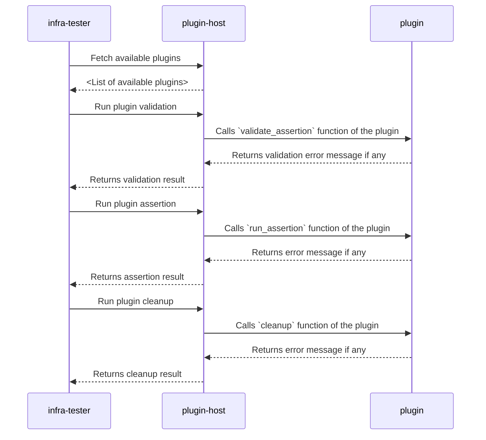

# Writing Plugins

Even though *infra-tester* provides several inbuilt assertions for
tests, there will always be a case where you'll have to test something
that might not be possible with just the inbuilt set of assertions.

Since infrastructure varies a lot this is bound to happen, and a good
way to tackle this is through plugins.

*infra-tester* provides a plugin system where you can create your custom assertions in Python and then consume them through YAML configuration.
This way, plugin owners can create assertions that can then be shared or
published so that others who may not be proficient in Python could use
them by installing the plugin.

Let's see how the plugin system works.

## Plugin Design

*infra-tester* chose Python 3.8 and above as the plugin language for the following reasons:

- Python is a relatively simple language
- Has an extensive standard library that could assist in implementing plugins
- [Entry Point Spec](https://packaging.python.org/en/latest/specifications/entry-points/) which makes it an ideal ecosystem to write plugins
- The PIP package manager makes it easy to package and install plugins
  through the official PIP registry, a custom registry, or through a version
  control system or even install the plugin from a local file system

The below sequence diagram shows how *infra-tester* interacts with the plugins:



In the above diagram:

- **plugin-host** is a PIP package, which if installed enables plugin support
  for *infra-tester*.
- **plugin** is a PIP package that can be used by *infra-tester* as a plugin.

*infra-tester* uses the **plugin-host** to communicate with the plugin.

As a plugin implementor, you only have to be concerned about the **plugin** package.

## Plugin Host

You can install the plugin host by installing the `infra-tester-plugins` PIP package.

!!! info

    As of now, you can install the plugin host through PIP using the following command:
    ```shell
    pip install "git+https://github.com/schrodinger/infra-tester.git#egg=plugins&subdirectory=plugins/"
    ```

    We are currently looking into adding this package to the official PIP registry.

Once the package is installed, *infra-tester* will automatically enable plugin support.

## Plugins

### Requirements

Before starting, ensure that `infra-tester-plugins` package is installed. This provides the `BaseAssertionPlugin` class, which needs to be inherited to implement
the plugin.

As a best practice, it's recommended to follow a standard directory structure when
creating the Python package. Generally, it's recommended to follow the below
directory structure:

```
.
└── <package-directory-name>/
    ├── src/
    │   ├── <module1>/
    │   │   ├── __init__.py
    │   │   └── ...
    │   └── <module2>/
    │       ├── __init__.py
    │       └── ...
    ├── pyproject.toml
    └── setup.py
```

### The `BaseAssertionPlugin` Class

*infra-tester* provides the `BaseAssertionPlugin` base class which can be used
to implement the core of the plugin logic.

```python
from infra_tester_plugins import BaseAssertionPlugin

class CustomAssertionPlugin(BaseAssertionPlugin):
    def validate_inputs(self, inputs: dict): ...

    def run_assertion(self, inputs: dict, state: dict): ...

    def cleanup(self, inputs: dict, state: dict): ... # optional


def load_plugin() # A function that'll be referenced in pyproject.toml.
    # This function must return an instance of the assertion implementation.

    return CustomAssertionPlugin()
```

#### `#!python def validate_inputs(self, inputs: dict) -> Union[str, None]`:

Validate the inputs provided to the plugin. The inputs
will be in the form of a dictionary with the key being the
name of the input and the value being the value of the input.

This method should return `None` if the inputs are valid.
Otherwise, it should return a string describing the error.

Any exception thrown by this method will be treated as an
implementation error and will be logged as such.

=== "Arguments"

    | Name     | Description                                                       | Type       |
    | -------- | ----------------------------------------------------------------- | ---------- |
    | `inputs` | Python dictionary containing the inputs provided to the assertion | Dictionary |

=== "Exceptions"

    | Exception             | Description                                   |
    | --------------------- | --------------------------------------------- |
    | `NotImplementedError` | If the plugin does not implement this method. |

=== "Return Value"

    | Type               | Description                                                                            |
    | ------------------ | -------------------------------------------------------------------------------------- |
    | `Union[str, None]` | If the inputs are valid, return `None`. Otherwise, return a string describing the error. |


#### `#!python def run_assertion(self, inputs: dict, state: dict) -> Union[str, None]`:

This method should contain the logic to run the assertion
and return the result.

If the assertion fails, this method should return a
string describing the error. Otherwise, it should return
`None`.

This method should not raise any exception. Any exception
thrown by this method will be treated as an implementation
error and will be logged as such.

=== "Arguments"

    | Name     | Description                                                       | Type       |
    | -------- | ----------------------------------------------------------------- | ---------- |
    | `inputs` | Python dictionary containing the inputs provided to the assertion | Dictionary |
    | `state` | Python dictionary containing the Terraform state information | Dictionary |

=== "Exceptions"

    | Exception             | Description                                   |
    | --------------------- | --------------------------------------------- |
    | `NotImplementedError` | If the plugin does not implement this method. |

=== "Return Value"

    | Type               | Description                                                                            |
    | ------------------ | -------------------------------------------------------------------------------------- |
    | `Union[str, None]` | `None` if the assertion passes. Otherwise return a string describing why the assertion failed. |


#### `#!python def cleanup(self, inputs: dict, state: dict) -> None`:

Cleanup any resources used by the plugin. This method
will be called after the plugin has been run regardless
of whether the run was successful or not. It is optional
and does not need to be implemented if there's nothing to
clean up.

If this method is implemented, it should be
idempotent, i.e, cleanup should always have the same end
result regardless of how many times it is called. Cleanup
is considered successful if it does not raise any exception.

=== "Arguments"

    | Name     | Description                                                       | Type       |
    | -------- | ----------------------------------------------------------------- | ---------- |
    | `inputs` | Python dictionary containing the inputs provided to the assertion | Dictionary |
    | `state` | Python dictionary containing the Terraform state information | Dictionary |


### `pyproject.toml` and `setup.py`

The plugin packages need to provide `pyproject.toml` and `setup.py` files for the
following reasons:

- Make the plugin installable through PIP package manager.
- Register the package as an *infra-tester* plugin.

See [project.toml documentation](https://pip.pypa.io/en/stable/reference/build-system/pyproject-toml/) to create a `pyproject.toml` file for your plugin.

Apart from this, one important part of creating `pyproject.toml` file is to register the
package as a plugin by adding it to the `infra-tester.assertion` [entry points](https://setuptools.pypa.io/en/latest/userguide/entry_point.html#entry-points-for-plugins) group.
This can be done by defining a `[project.entry-points."infra_tester.assertion"]` section in the `pyproject.toml` file, like so:

=== "pyproject.toml"

    ```toml
    [project.entry-points."infra_tester.assertion"]
    <UniqueAssertionName1> = "<package_or_module1>:load_plugin"
    <UniqueAssertionName1> = "<package_or_module1>:load_plugin"
    ...
    ```

=== "Example"

    ```toml
    [project.entry-points."infra_tester.assertion"]
    ExampleAssertion = "example:load_plugin"
    URLReachable = "url_reachable:load_plugin"
    ```

!!! info

    A single python package can register multiple plugins (assertions). This
    makes it easy to create for example an "infra-tester-network-assertion"
    which provides several different network assertions as plugins.

It's strongly recommended to create a `setup.py` for the project as well to
support older PIP versions too. You can use a shim in `setup.py` to not
have duplicated configuration like so:

```python title="setup.py" linenums="1"
import setuptools

if __name__ == "__main__":
    setuptools.setup()
```

## Example Plugin Package

This section shows an example package that provides two plugins:

- "ExampleAssertion" that just prints the inputs and state in the test logs.
- "URLReachable" that checks whether a URL is reachable.

=== "ExampleAssertion"

    ```python linenums="1" title="example/plugin-example/src/example/__init__.py"
    --8<-- "example/plugin-example/src/example/__init__.py"
    ```

=== "URLReachable"

    ```python linenums="1" title="example/plugin-example/src/url_reachable/__init__.py"
    --8<-- "example/plugin-example/src/url_reachable/__init__.py"
    ```

=== "pyproject.toml"

    This registers both the "ExampleAssertion" and "URLReachable" assertions

    ```toml linenums="1" title="example/plugin-example/pyproject.toml"
    --8<-- "example/plugin-example/pyproject.toml"
    ```

=== "Usage in config.yaml"

    ```yaml linenums="42" title="example/config.yaml"
    ...
      - name: ExamplesCustomAssertions
        apply:
            assertions:
            - name: ThisOneAlwaysSucceeds
              type: ExampleAssertion

            - name: URLShouldBeReachable
              type: URLReachable
              url: https://www.schrodinger.com

            - name: URLRedirectsAreFollowedToReachableURL
              type: URLReachable
              url: http://www.schrodinger.com
              status_code: 200

            - name: OutputURLShouldBeReachable
              type: URLReachable
              url: sample_url
              from_outputs: true

            - name: URLShouldNotBeReachable
              type: URLReachable
              url: https://google.com/doesnotexist
              status_code: 404
    ...
    ```

=== "Package Directory Structure"

    ```
    . # example/ folder in the infra-tester git repo
    └── plugin-example
        ├── pyproject.toml
        ├── setup.py
        └── src
            ├── example
            │   └── __init__.py
            └── url_reachable
                └── __init__.py
    ```


### Testing Your Plugin

You may use the `infra-tester-run-plugin` command to execute your plugin
independently to test its working. We also recommend writing unit tests
for your plugins to catch any issues early on.

Run `infra-tester-run-plugin -h` to see how to use this CLI command.

### Listing Available Plugins

You can list the available packages using the `infra-tester-plugin-manager`
CLI command provided by the `infra-tester-plugins` package.

```
$ infra-tester-plugin-manager --list
ExampleAssertion
URLReachable
```

## Conclusion

The plugin system provides a mechanism in which developers can write plugins in
Python and then publish them so that other people who may not be familiar with
Python or programming in general could still write tests in a simple YAML config.

As with all plugin systems which allows running external code, make sure you trust
the plugin by auditing its code to ensure that unwanted code is not executed in your
environment.

If you feel a plugin might be a better fit as an inbuilt assertion, please reach
out by raising an issue in our [GitHub repository](https://github.com/schrodinger/infra-tester).
