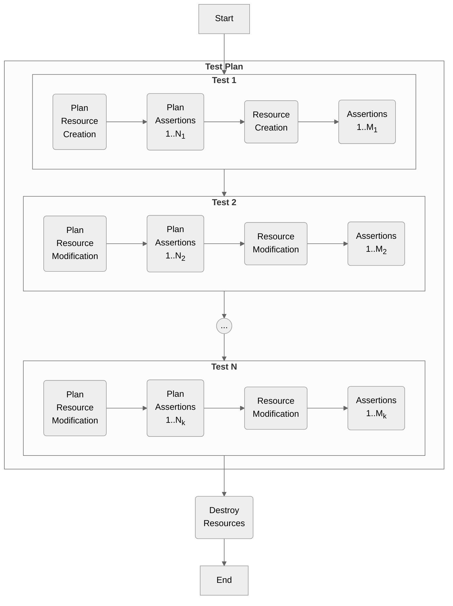

# How infra-tester Works Internally

*infra-tester* uses [**terratest**](https://terratest.gruntwork.io/) internally to run Terraform tests. 
Once *infra-tester* parses the test configuration, for each test:

  1. If at least one plan assertion is found, it'll run **`terraform plan`** with the input variables if defined.
  2. It then runs all the assertions under the plan step.
  3. If any of the plan step assertions fails, it skips the apply assertions for the test. This can be considered a "fail fast" mechanism
     to prevent unnecessary cost and time wastage when the plan tests have failed.
  4. If all the plan assertions were successful, it then proceeds to apply assertions.
  5. *infra-tester* runs **`terraform plan`** with the input variables if defined. Note that a destroy won't be called before running the
     apply unless `with_clean_state` is set to true. This is for efficiency reasons, see [**`test_plan.tests.with_clean_state`**](/configuration/#test_plantestswith_clean_state).
  6. Once all the tests are run, *infra-tester* proceeds to destroy all resources as a final cleanup procedure.

